# Active Directory GPO Security Lab

## Project Overview

This project demonstrates the implementation and enforcement of enterprise-level password policies and account lockout policies using Active Directory Group Policy Objects (GPOs) within a Windows Server environment.

The goal of this lab was to strengthen identity and access management by enforcing authentication controls that reduce the risk of brute force attacks, unauthorized access, credential compromise, and weak password usage across an enterprise environment.

In addition to configuring and testing Group Policy settings, this project focused heavily on developing technical documentation and understanding the enterprise security relevance behind centralized policy enforcement.

---

# Security Concepts Covered

* Authentication Security
* Access Control
* Least Privilege
* Group Policy Management
* Centralized Administration
* Password Security
* Brute Force Mitigation
* Account Lockout Policies
* Security Policy Enforcement
* Enterprise Endpoint Management

---

# Enterprise Relevance

Organizations use Group Policy Objects (GPOs) to centrally configure and enforce security settings across domain-joined systems within enterprise environments.

Centralized policy management improves:

* Security consistency
* Administrative efficiency
* Policy enforcement
* Endpoint security management
* Risk reduction
* Authentication control standardization

This type of configuration is commonly used in enterprise environments to reduce unauthorized access attempts and strengthen organizational security posture.

---

# Lab Objectives

* Configure password policies using Group Policy
* Configure account lockout settings
* Apply policies through Active Directory
* Test policy enforcement on domain users
* Understand how authentication controls reduce enterprise security risk
* Practice enterprise-style security documentation and troubleshooting

---

# Lab Environment

## Domain Controller

* Server Name: RTS-DC1
* Operating System: Windows Server 2022
* Domain Name: rtsnetwork.local

## Client Machine

* Machine Name: Win 10 Lab
* Operating System: Windows 10 Pro

## Virtualization Platform

* VirtualBox

---

# Tools & Technologies Used

* Windows Server 2022
* Windows 10 Pro
* Active Directory Users and Computers
* Group Policy Management Console (GPMC)
* Local Security Policy
* Command Prompt
* gpupdate
* gpresult
* VirtualBox

---

# Policy Planning

## Password Policy Goals

| Setting                 | Configuration          |
| ----------------------- | ---------------------- |
| Minimum Password Length | 10 Characters          |
| Password Complexity     | Enabled                |
| Password History        | 3 Passwords Remembered |
| Maximum Password Age    | 90 Days                |

### Security Purpose

These password policies were implemented to strengthen authentication security and reduce the risk of weak user-generated passwords being exploited by attackers.

The configured policies help:

* Reduce credential compromise risk
* Enforce stronger authentication practices
* Improve enterprise password hygiene
* Reduce the likelihood of brute-force attacks

---

## Account Lockout Policy Goals

| Setting                | Configuration |
| ---------------------- | ------------- |
| Failed Login Threshold | 5 Attempts    |
| Lockout Duration       | 15 Minutes    |
| Reset Counter Time     | 15 Minutes    |

### Security Purpose

These account lockout settings were configured to mitigate brute-force and password-guessing attacks by limiting repeated invalid authentication attempts.

The selected thresholds balance both:

* Security protection
* Operational usability

while helping reduce unauthorized authentication activity across the enterprise environment.

---

# Implementation Steps

## Step 1 – Open Group Policy Management

### Actions Performed

* Accessed Group Policy Management Console (GPMC)
* Reviewed Active Directory domain structure
* Verified existing domain policies

### Why This Step Matters

Group Policy is a centralized Windows administration feature that allows administrators to configure and enforce security settings, user restrictions, and operational policies across enterprise systems.

Centralized management helps:

* Enforce consistent security controls
* Reduce configuration drift
* Improve administrative efficiency
* Standardize organizational configurations

### Screenshot

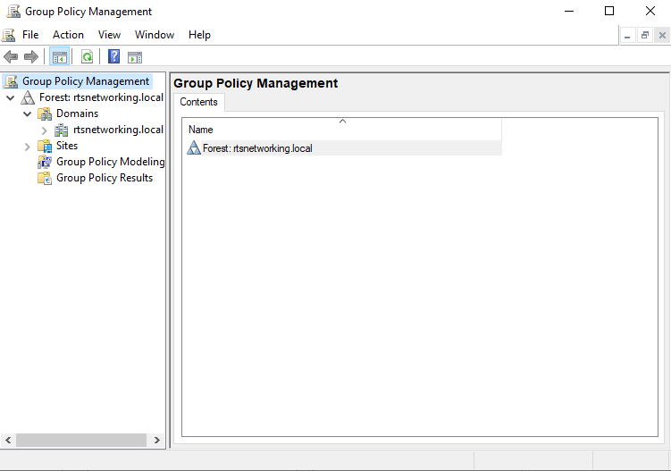

---

## Step 2 – Create or Edit Group Policy Object

### Actions Performed

* Accessed Default Domain Policy
* Reviewed existing domain policy structure
* Prepared policy settings for implementation

### Security Purpose

Domain-level policies allow administrators to centrally configure and deploy security settings across all domain-joined systems.

Centralized policy enforcement helps reduce:

* Unauthorized configurations
* Security gaps
* Policy inconsistencies
* Endpoint misconfigurations

### Screenshot

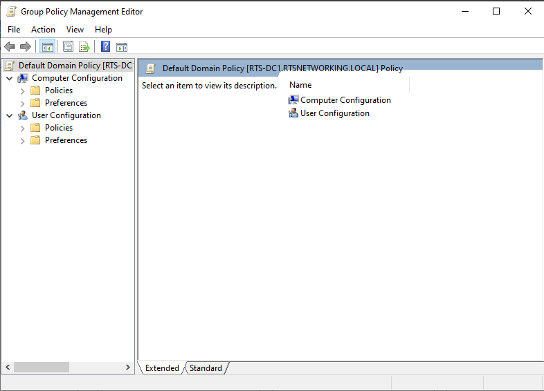

---

## Step 3 – Configure Password Policy

### Actions Performed

* Configured minimum password length
* Enabled password complexity requirements
* Configured password history settings
* Configured maximum password age

### Security Analysis

Strong password policies help improve organizational security posture by reducing the likelihood of credential compromise caused by weak or reused passwords.

These controls help mitigate:

* Brute-force attacks
* Password guessing attacks
* Weak password usage
* Credential reuse risks

### Screenshot

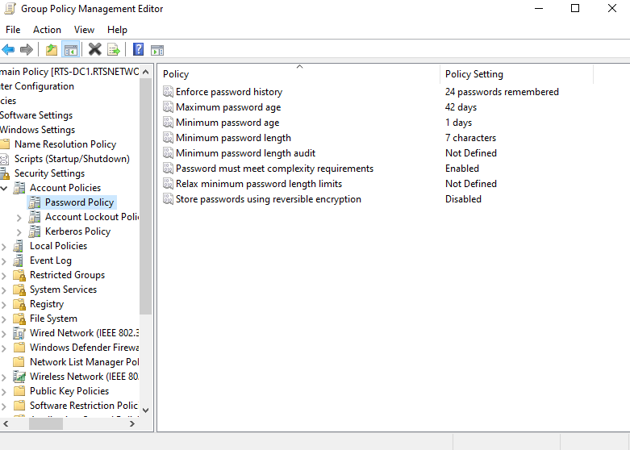

---

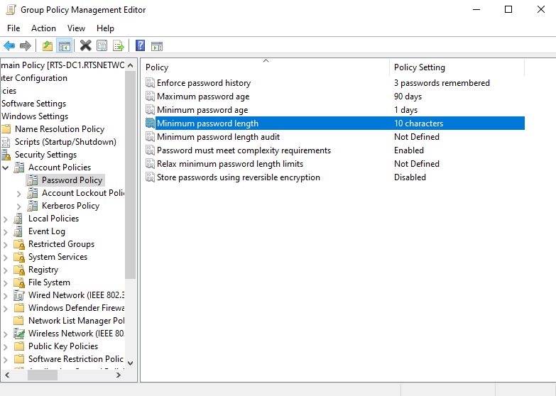

---

## Step 4 – Configure Account Lockout Policy

### Actions Performed

* Configured failed login threshold
* Configured account lockout duration
* Configured reset counter duration

### Security Analysis

Account lockout policies help reduce the attack surface associated with repeated unauthorized authentication attempts.

These controls help mitigate:

* Automated brute-force attacks
* Password guessing attempts
* Unauthorized account access activity

### Operational Tradeoffs

Strict account lockout policies may introduce operational challenges if legitimate users become locked out or if administrative accounts are targeted.

### Screenshot

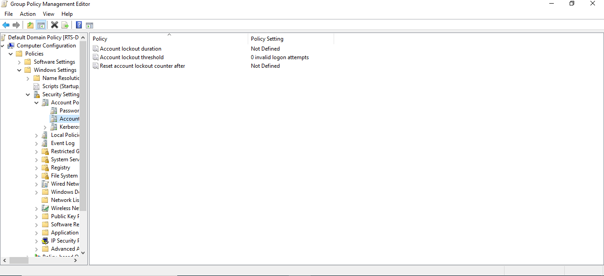

---

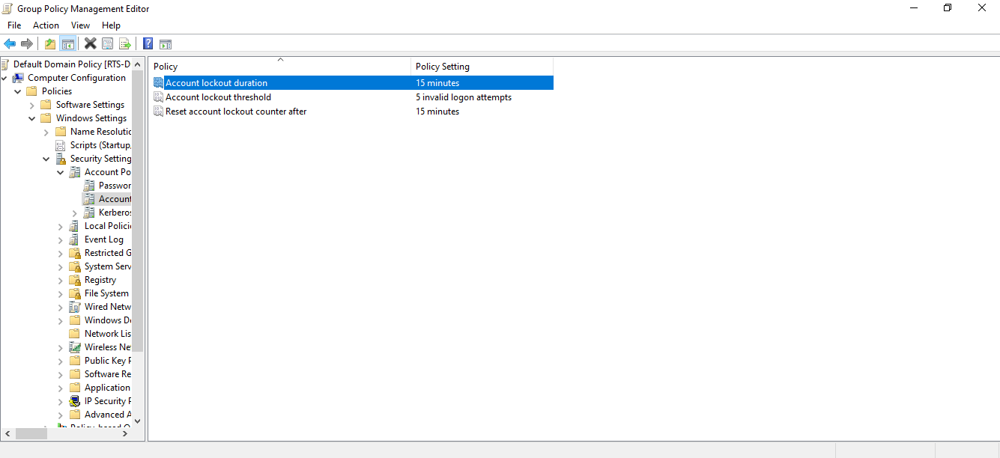

---

## Step 5 – Apply Group Policy Updates

### Actions Performed

* Executed `gpupdate /force`
* Refreshed domain policies
* Verified successful policy synchronization

### Why This Step Matters

Policy updates must refresh after configuration changes to ensure systems receive the latest security controls and policy settings.

Timely policy synchronization helps:

* Maintain a consistent security posture
* Reduce outdated configurations
* Improve policy enforcement consistency

### Screenshot

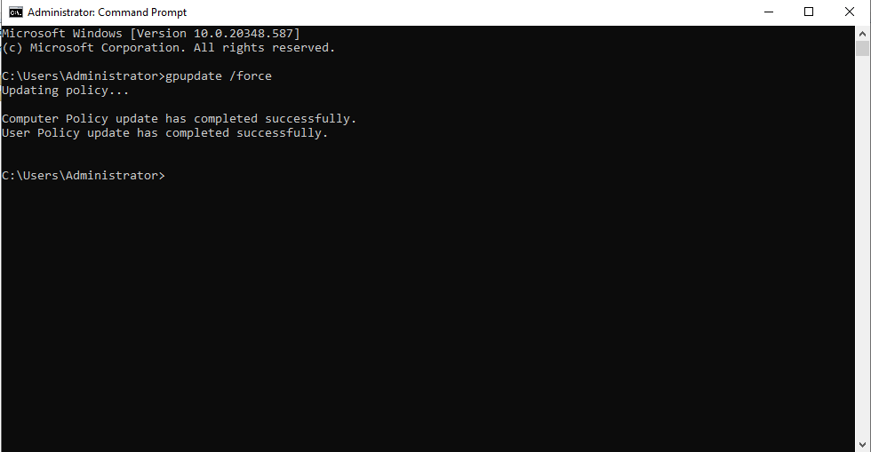

---

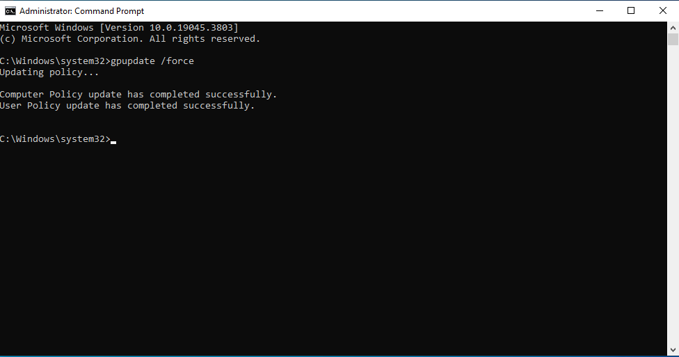

---

## Step 6 – Test Password Policy Enforcement

### Tests Performed

* Weak password test
* Password complexity test
* Password reuse test

### Findings

When attempting to configure weak passwords for a domain user account, Windows rejected the password change because the configured password policy requirements were not satisfied.

### Security Behavior Enforced

* Password complexity enforcement
* Strong password requirements
* Password reuse prevention

### Screenshot

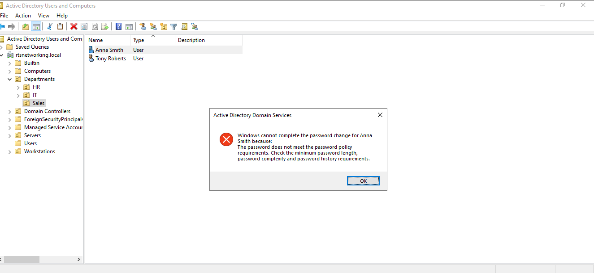

---

## Step 7 – Test Account Lockout Policy

### Tests Performed

* Multiple failed login attempts
* Account lockout trigger validation
* Lockout reset verification

### Findings

The account lockout policy successfully triggered after repeated failed login attempts.

### Enterprise Security Relevance

This control helps organizations identify suspicious authentication activity while reducing the likelihood of unauthorized account compromise through repeated login attempts.

### Screenshots

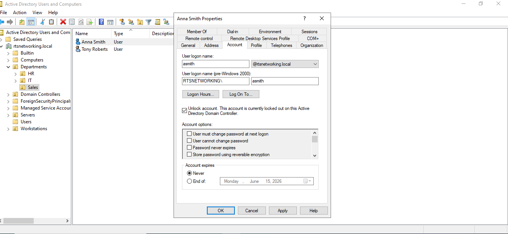

*Reviewed administrative recovery procedures for locked domain accounts following account lockout enforcement.*

---

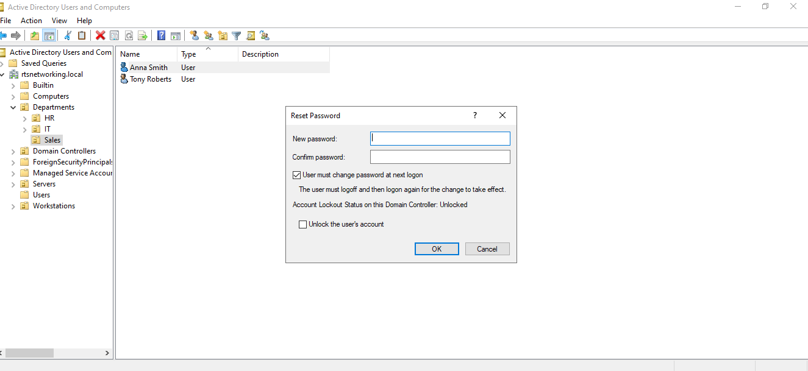

*Performed administrative password reset procedures for a locked domain user account through Active Directory Users and Computers.*

---

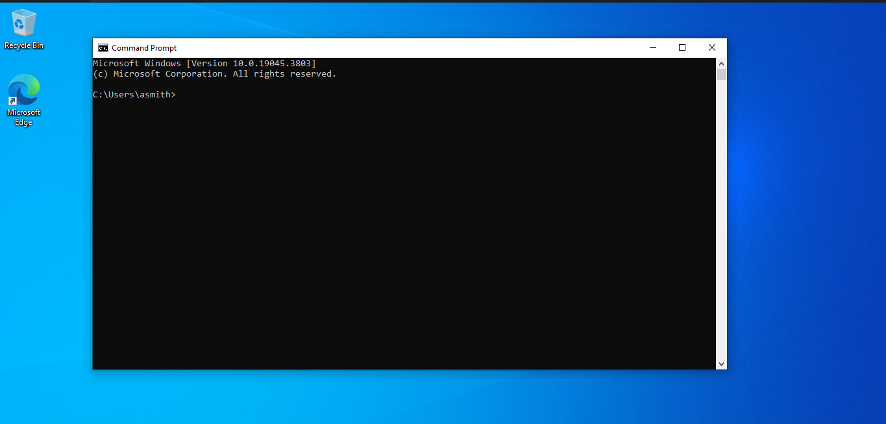

*Verified successful restoration of user account access after administrative remediation and password reset procedures.*

# Troubleshooting & Challenges

## Challenge #1 – GPO Verification Failure

### Problem

Configured Group Policy Objects initially failed to appear on the Windows 10 client during policy verification.

### Symptoms

Running the command:

```powershell
gpresult -r
```

returned:

```powershell
Applied Group Policy Objects: N/A
```

with additional output indicating:

```powershell
The user "RTSNETWORKING\Administrator" does not have RSoP data.
```

### Diagnosis

The issue occurred because Command Prompt was launched with administrative privileges.

As a result, the workstation queried Resultant Set of Policy (RSoP) information for the Administrator account instead of the currently logged-in domain user or computer scope.

### Resolution

* Executed `gpupdate /force`
* Verified policy application using:

```powershell
gpresult /r /scope computer
```

### Result

Successful communication with the domain controller and proper application of the Default Domain Policy were verified.

---

# Security Perspective

## Risks Reduced

* Brute-force attacks
* Weak passwords
* Unauthorized access
* Credential abuse
* Password guessing attacks

## Security Principles Reinforced

* Least Privilege
* Defense-in-Depth
* Centralized Administration
* Authentication Security
* Policy Enforcement

---

# Lessons Learned

* Group Policy allows administrators to centrally enforce authentication controls across enterprise environments.
* Password complexity and account lockout policies help reduce the likelihood of credential compromise.
* Centralized management improves operational consistency and reduces administrative overhead.
* Proper troubleshooting and verification are critical when validating policy deployment.
* Security documentation is essential for communicating configurations, findings, and operational impact.

---

# Future Improvements

Planned future enhancements include:

* USB device restriction policies
* Software restriction policies
* Login banners
* Audit logging configuration
* Security event monitoring
* Additional workstation hardening policies

---

# Conclusion

## What This Lab Demonstrated

This project demonstrated how Group Policy Objects can be used within Active Directory environments to centrally enforce authentication security controls and improve enterprise security management.

## Key Security Takeaways

* Strong authentication policies help reduce organizational risk.
* Centralized administration improves policy consistency.
* Account lockout controls help mitigate unauthorized authentication attempts.
* Proper policy enforcement contributes to maintaining a stronger enterprise security posture.

## Real-World Relevance

These configurations are commonly used in enterprise environments to strengthen identity and access management while supporting organizational security and compliance objectives.

---

# Skills Developed

* Active Directory Administration
* Group Policy Management
* Windows Server Administration
* Authentication Security
* Troubleshooting & Diagnostics
* Technical Documentation
* Security Policy Enforcement
* Enterprise Security Concepts
* Risk Reduction Analysis
* Centralized System Administration
